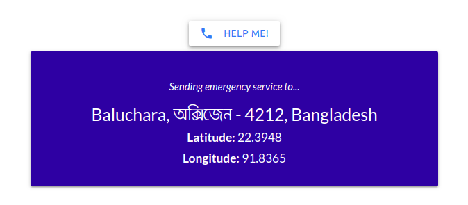

# emergency-support

## Project idea

The project idea was to extract nearby location of Mr. X phone call request. We may assume that, Mr. X sent a request from a website for emergency support. So, If he allowed the location service for the website then we can extract his present location coordinates by the help of HTML5 Geolocation service. And, If he didn't allow the location service we can get the location coordinates by the request IP address. After then, we can get his address information by using Location API.

## Python version: 3.5+

## Instructions to run the script

1. Goto the directory where you want to store your project.
2. Clone the git repository to the project directory.
3. Open the terminal and navigate to the project directory from the terminal.
4. Create virtual environment from the terminal by typing ```virtualenv .env``` and activate it by typing `source .env/bin/activate`(for Linux), '.env\Scripts\activate'(for Windows).
    * If you don't have `virtualenv` installed then install it by typing `pip install virtualenv`.
5. Install the project dependencies by typing `pip install -r requirements.txt` on the terminal.
6. Create `config.local.json` file with the same content of `config.json` file.
7. Migrate the database by typing `python manage.py makemigrations` and then `python manage.py migrate` on the terminal.
8. Create admin user if you want by typing `python manage.py createsuperuser` and give the required credentials on the terminal.
9. Now, Run the project from your **localhost** by typing `python manage.py runserver`
10. Navigate to the URL [127.0.0.1:8000](127.0.0.1:8000) from your browser.
11. Click the **HELP ME!** button to get the address.
12. You can terminate the server anytime by **CTRL+c**.

### API's used to get the informations:
1. **For IP Address:** https://www.ipify.org/
2. **For Location Coordinates:** https://ipapi.co/
3. **For Location Details:** https://opencagedata.com/api

**N.B. :** *For better accuracy and in search of street address I have used 3 API's. We can use less if we want.*


## Snapshots:


